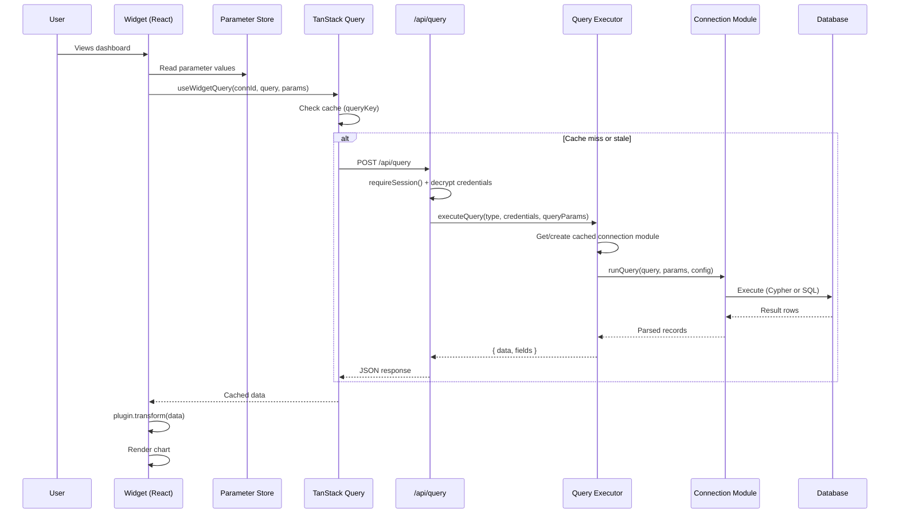
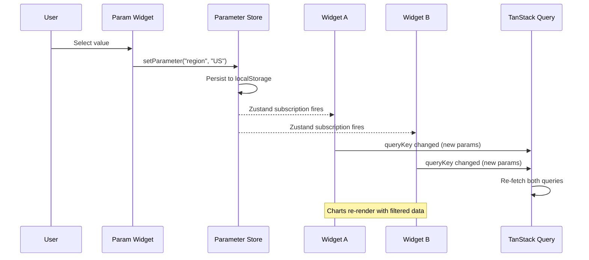
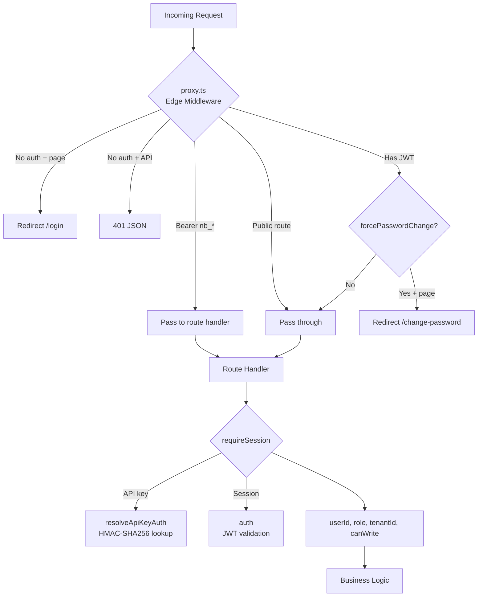
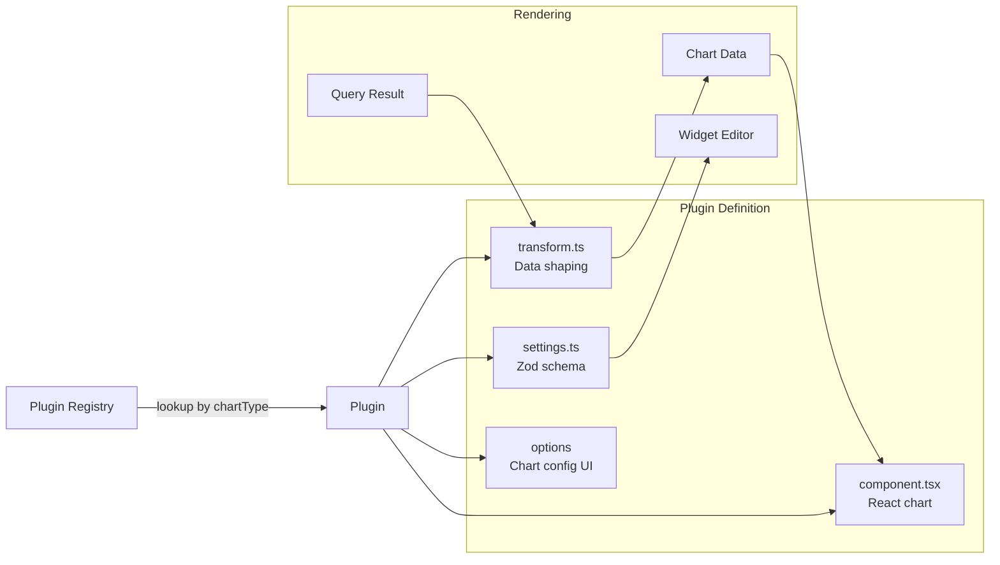

# NeoBoard Architecture

## Package Boundaries

```
                    +-----------------------+
                    |       app/            |
                    |  Next.js Application  |
                    |  API routes, stores,  |
                    |  hooks, pages, plugins|
                    +------+--------+-------+
                           |        |
              imports UI   |        |  imports connectors
                           v        v
            +----------------+   +------------------+
            |  component/    |   |  connection/      |
            |  React UI lib  |   |  DB connector lib |
            |  Charts, forms |   |  Neo4j, Postgres  |
            |  shadcn/ui     |   |  Query execution  |
            +-------+--------+   +------------------+
                    |                     ^
                    |  imports types      |
                    +---------------------+
```

**Rules:**

- `connection/` has zero UI or React dependencies
- `component/` has zero business logic, API calls, or store imports
- `app/` orchestrates both — it's the only package that imports from the other two

## Data Flow: Query Execution



## Data Flow: Parameter Updates



## Authentication Flow



## Plugin System



**20 chart plugins:** bar, line, pie, gauge, single-value, table, graph, map, json, markdown, form, iframe, sankey, sunburst, radar, treemap, parameter-select, circle-packing, choropleth, heatmap

## State Management

```
+-------------------+     +---------------------+     +------------------+
| Dashboard Store   |     | Widget Editor Store  |     | Parameter Store  |
| (Zustand)         |     | (Zustand)            |     | (Zustand)        |
|                   |     |                      |     |                  |
| - layout (pages,  |     | - chartType          |     | - parameters{}   |
|   widgets, grid)  |     | - connectionId       |     | - localStorage   |
| - activePage      |     | - query              |     |   persistence    |
| - _dirty flag     |     | - chartOptions       |     | - per-dashboard  |
| - CRUD operations |     | - clickActions       |     |   isolation      |
+-------------------+     | - stylingRules       |     +------------------+
                          | - transforms         |
+-------------------+     +---------------------+     +------------------+
| Connection Store  |                                  | Schema Store     |
| (Zustand)         |     +---------------------+     | (Zustand)        |
|                   |     | TanStack Query Cache |     |                  |
| - activeConnId    |     |                      |     | - schemas by     |
| - widget->conn    |     | - dashboards[]       |     |   connectionId   |
|   mapping         |     | - connections[]      |     +------------------+
+-------------------+     | - widget-query[]     |
                          | - users[]            |     +------------------+
                          | - api-keys[]         |     | Graph Widget     |
                          | - widget-templates[] |     | Store (Zustand)  |
                          +---------------------+     |                  |
                                                      | - nodes, edges   |
                                                      | - per-widget     |
                                                      +------------------+
```

## Directory Structure (after lib/ reorg)

```
app/src/
├── app/                    # Next.js App Router
│   ├── (auth)/             # Public: login, signup, change-password
│   ├── (dashboard)/        # Protected: dashboard pages
│   └── api/                # 27 API routes
├── components/             # App-level React components
├── hooks/                  # TanStack Query hooks (20+)
├── stores/                 # Zustand stores (6)
├── plugins/                # Chart plugin definitions (17)
│   ├── transforms/         # Data transform functions
│   └── settings/           # Zod settings schemas
├── lib/
│   ├── api/                # API client, response helpers, OpenAPI
│   ├── auth/               # Session, API key, signup, bootstrap
│   ├── connector/          # Connection adapter, types, schema prefetch
│   ├── crypto/             # AES-256-GCM encryption, rate limiter
│   ├── dashboard/          # Export, import, migrate, thumbnails
│   ├── db/                 # Drizzle ORM client + schema
│   ├── parameter/          # Collect, format, apply defaults
│   ├── plugin/             # Chart registry, helpers
│   ├── query/              # Executor, hash, cache, params, transforms
│   ├── shared/             # Date utils, normalize, parse, URL params
│   └── widget/             # Utils, actions, click, form fields
└── proxy.ts                # Edge middleware (auth guard)

component/src/
├── charts/                 # ECharts wrappers (BaseChart + 14 types)
├── components/
│   ├── ui/                 # 38 shadcn/ui primitives
│   └── composed/           # 43 higher-order components
├── hooks/                  # useWidgetSize, useContainerSize
└── lib/                    # Utilities, design tokens, Cypher language

connection/
├── src/
│   ├── generalized/        # Abstract bases (ConnectionModule, AuthModule, RecordParser)
│   ├── neo4j/              # Neo4j driver implementation
│   ├── postgresql/         # PostgreSQL pg implementation
│   └── schema/             # Schema introspection managers
└── dist/                   # Compiled JS + .d.ts (built via tsc)
```

## Database Schema (key tables)

```
users            connections         dashboards          dashboardShares
+-----------+    +---------------+   +---------------+   +---------------+
| id (PK)   |    | id (PK)       |   | id (PK)       |   | id (PK)       |
| email      |    | userId (FK)   |   | userId (FK)   |   | dashboardId   |
| role       |    | tenantId      |   | tenantId      |   | userId (FK)   |
| canWrite   |    | type (enum)   |   | name          |   | tenantId      |
| tenantId   |    | configEncrypt |   | layoutJson    |   | role (enum)   |
+------------+    | advancedJson  |   | thumbnailJson |   +---------------+
                  +---------------+   +---------------+

apiKeys              widgetTemplates
+---------------+    +---------------+
| id (PK)       |    | id (PK)       |
| userId (FK)   |    | chartType     |
| tenantId      |    | connectorType |
| keyHash       |    | query         |
| expiresAt     |    | settings      |
+---------------+    | tenantId      |
                     +---------------+
```

**Multi-tenancy:** Every table includes `tenantId`. All queries filter by tenant at the ORM level.

**Encryption:** Connection credentials use AES-256-GCM with the `ENCRYPTION_KEY` (a 64-character hex string = 32 bytes) as the key directly (no HKDF derivation, no envelope wrapping); ciphertext is stored as `iv:authTag:ciphertext` (base64), with key rotation via `ENCRYPTION_KEY_OLD`. Lost `ENCRYPTION_KEY` = all credentials unrecoverable.
