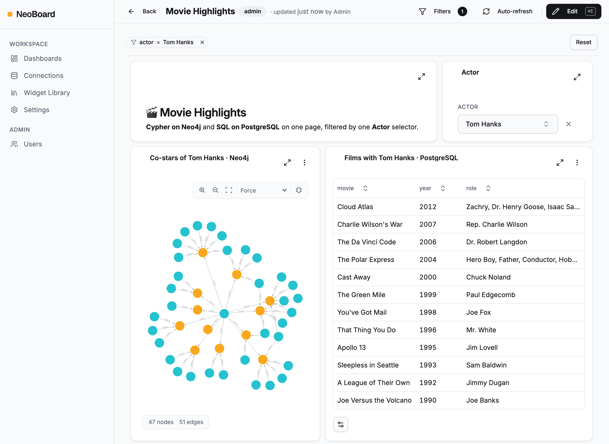

<div align="center">

# NeoBoard

Neo4j and PostgreSQL dashboards, together on one canvas

<em>Self-hosted, and no commercial database licence required</em>

[Documentation](docs/src/content/docs/) · [Quick start](#quick-start) · [Migrate from NeoDash](docs/src/content/docs/start-here/migration-from-neodash.mdx) · [Plugins](PLUGINS.md)

[](https://github.com/alfredo1996/neoboard/actions/workflows/ci.yml)
[](https://sonarcloud.io/dashboard?id=alfredo1996_neoboard)
[](LICENSE)
[](https://github.com/alfredo1996/neoboard/pkgs/container/neoboard)

</div>

<picture>
  <source media="(prefers-color-scheme: dark)" srcset="screenshots/hero-dark.png">
  
</picture>

NeoBoard is a dashboard builder you run yourself: write Cypher and SQL in the browser and turn the results into charts, graphs, maps and tables. It works with community Neo4j and plain PostgreSQL, so nothing needs an enterprise agreement.

## Why NeoBoard?

- **Neo4j and PostgreSQL on one canvas** — a Cypher widget and a SQL widget read the same parameters, so one filter drives both. [Connectors](docs/src/content/docs/using/connectors.mdx)
- **16 chart types** — bar, line and table through graph, map, Sankey and Gantt. [Charts](docs/src/content/docs/charts/index.mdx)
- **Interactive** — selectors and click actions set parameters, and rule-based styling colours values. [Parameters](docs/src/content/docs/using/parameters.mdx)
- **Share and automate** — share dashboards with people or your whole workspace, auto-refresh them, and call the REST API with API keys. [API keys](docs/src/content/docs/security/api-keys.mdx)
- **Safe by default** — widgets other than forms run read-only, with row limits and timeouts, and connection credentials are encrypted with AES-256-GCM. [Query safety](docs/src/content/docs/security/query-safety.mdx)
- **A way off NeoDash** — import your NeoDash JSON; charts, parameters and layout are mapped for you. [Migration guide](docs/src/content/docs/start-here/migration-from-neodash.mdx)

## Quick Start

Needs Docker and Node.js 20+ ([install requirements](docs/src/content/docs/start-here/install.mdx)).

```bash
git clone https://github.com/alfredo1996/neoboard.git
cd neoboard
bash install.sh   # installs deps, starts Docker, runs migrations
# → http://localhost:3000
```

Create the first admin at <http://localhost:3000/signup> with the bootstrap token from the ready banner. `neoboard demo` loads seven sample dashboards, and creates the demo admin `admin@neoboard.local` / `admin123` only when no user exists yet; the [tour](docs/src/content/docs/start-here/tour.mdx) walks through them.

The CLI is not on npm yet, so install from a clone. If setup fails, see [Troubleshooting](docs/src/content/docs/start-here/troubleshooting.mdx).

## Deploy

For production, run the Docker Compose stack, built from your checkout or pulled as `ghcr.io/alfredo1996/neoboard`: see [Production Deployment](docs/src/content/docs/deploy/production.mdx). Back up `ENCRYPTION_KEY` — if you lose it, every stored connection credential is unrecoverable.

## Contributing

[DEVELOPMENT.md](DEVELOPMENT.md) covers local setup and [CONTRIBUTING.md](.github/CONTRIBUTING.md) covers branches and pull requests. New here? Pick a [`good first issue`](https://github.com/alfredo1996/neoboard/labels/good%20first%20issue).

## License

[Elastic License 2.0](LICENSE) with an AI training restriction. You may use, modify and self-host NeoBoard, but you may not offer it to others as a hosted or managed service, or use it to train AI models without written permission.
