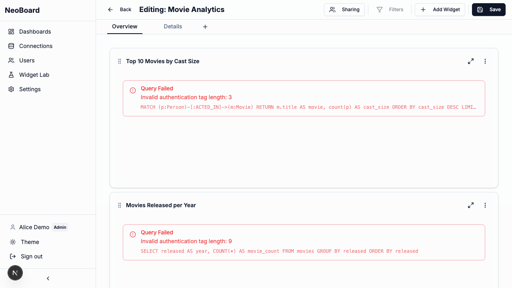
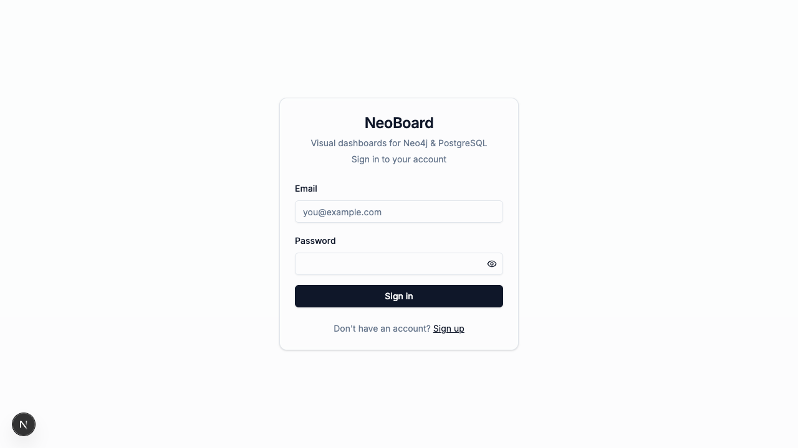
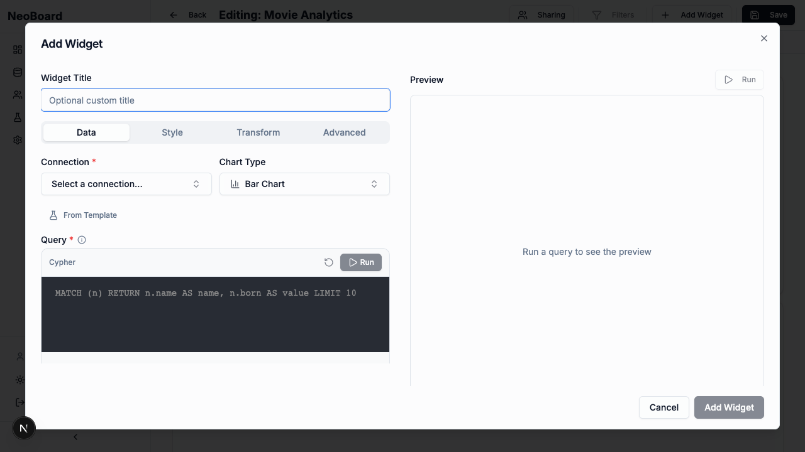
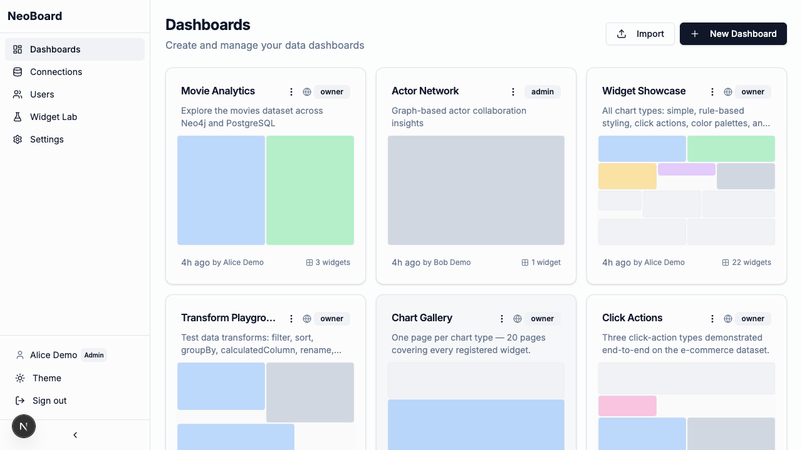

<p align="center">
  <h1 align="center">NeoBoard</h1>
  <p align="center">
    Open-source dashboards for Neo4j + PostgreSQL
    <br />
    <em>The modern alternative to NeoDash</em>
  </p>
  <p align="center">
    <a href="https://github.com/alfredo1996/neoboard/actions/workflows/ci.yml"></a>
    <a href="https://sonarcloud.io/dashboard?id=alfredo1996_neoboard"></a>
    <a href="https://sonarcloud.io/component_measures?id=alfredo1996_neoboard&metric=coverage"></a>
    <a href="LICENSE"></a>
  </p>
  <p align="center">
    = 20" src="https://img.shields.io/badge/node-%3E%3D20-brightgreen" />
    <a href="https://github.com/alfredo1996/neoboard/pkgs/container/neoboard"></a>
    <a href="https://github.com/alfredo1996/neoboard/stargazers"></a>
    <a href="https://github.com/alfredo1996/neoboard/issues?q=label%3A%22good+first+issue%22"></a>
  </p>
</p>

---



**NeoBoard** is a free, self-hosted dashboarding platform for teams working with Neo4j graph databases and PostgreSQL. Build interactive dashboards with 20 chart types, write queries directly, and share insights — all from a modern web interface.

## Why NeoBoard?

- **NeoDash alternative** — built for teams migrating from Neo4j's deprecated NeoDash
- **Hybrid databases** — connect Neo4j and PostgreSQL in the same dashboard
- **Modern stack** — Next.js 16, React 19, TypeScript, ECharts, Zustand, TanStack Query
- **Extensible charts** — 20 chart types with rule-based styling, click actions, and color palettes

## Quick Start

```bash
git clone https://github.com/alfredo1996/neoboard.git
cd neoboard
bash install.sh   # installs deps, starts Docker, runs migrations
# → http://localhost:3000
```

`install.sh` bootstraps the bundled `neoboard` CLI, brings up Postgres + Neo4j in Docker, runs migrations, and prints the next-step commands. After it finishes:

- Create your first admin at <http://localhost:3000/signup> using the bootstrap token printed in the ready banner (also in `docker/.env` as `ADMIN_BOOTSTRAP_TOKEN`)
- Run `neoboard demo` to seed the showcase dashboards (optional, see below)
- Run `neoboard doctor` to check service health if anything looks off; `neoboard --help` for the full command list

> **Note:** an `npx @neoboard/cli` standalone install path is on the roadmap but the package is not on npm yet — clone the repo for now.

If something breaks during install (port conflict, DB refuses, migration fails, lost encryption key, OAuth redirect mismatch), see [Troubleshooting Setup](docs/src/content/docs/getting-started/troubleshooting.mdx).

### Demo showcases

Want pre-loaded dashboards that demo every chart type, every click-action, every transform, and rule-based styling? Use the `neoboard demo` CLI:

```bash
neoboard demo                                 # full setup + seed everything
neoboard demo seed                            # reseed showcases only
neoboard demo seed --only=chart-gallery       # reseed a subset
neoboard demo list                            # print available showcases
neoboard demo reset --force                   # purge showcase dashboards + demo schema
```

Four showcase dashboards get seeded:

| Showcase           | Pages | What it demonstrates                                                                       |
| ------------------ | ----- | ------------------------------------------------------------------------------------------ |
| Chart Gallery      | 20    | One page per registered chart type on the demo e-commerce data                             |
| Click Actions      | 5     | Drilldown, page navigation, and combined set-parameter-and-navigate                        |
| Transformations    | 6     | Before/after for `filter`, `sort`, `groupBy`, `calculatedColumn`, `renameColumns`, `limit` |
| Rule-Based Styling | 9     | Numeric, text, between-operator, and parameter-reference rules across chart types          |

The showcases live as portable JSON files under `scripts/demo/*.json` validated against `neoboardExportSchema` — you can import them on any NeoBoard instance.

The demo e-commerce data (customers, products, categories, orders, order_items, regions) is isolated in the `neoboard_demo_public` Postgres schema so `neoboard demo reset` can drop it without touching your own tables.

Demo login: `admin@neoboard.local` / `admin123`

### Docker (Production)

All Compose files live in [`docker/`](docker/) — there is intentionally no root-level `docker-compose.yml`, so pass `-f`:

```bash
export POSTGRES_PASSWORD=$(openssl rand -hex 16)
export ENCRYPTION_KEY=$(openssl rand -hex 32)     # lost key = stored credentials unrecoverable
export NEXTAUTH_SECRET=$(openssl rand -base64 32)
docker compose -f docker/docker-compose.prod-full.yml up -d
```

`docker-compose.prod-full.yml` bundles PostgreSQL (add `--profile neo4j` for a bundled Neo4j data source); `docker-compose.prod.yml` is the bring-your-own-database variant. The stack refuses to boot with missing secrets. See the [Production Deployment guide](docs/src/content/docs/getting-started/installation.mdx) for first-admin bootstrap, health verification, and TLS, and [`app/.env.example`](app/.env.example) for every variable.

Browse the [screenshots](#screenshots) below for a feel of the UI without installing.

## Features

| Category          | Details                                                                                                                                                                               |
| ----------------- | ------------------------------------------------------------------------------------------------------------------------------------------------------------------------------------- |
| **Charts**        | 20 types: Bar, Line, Pie, Table, Single Value, Gauge, Radar, Sankey, Sunburst, Treemap, Gantt, Circle Packing, Choropleth, Graph, Map, JSON, Form, Markdown, iFrame, Parameter Select |
| **Connectors**    | Neo4j (Bolt), PostgreSQL                                                                                                                                                              |
| **Parameters**    | Select, Multi-Select, Date, Date Range, Freetext — with cross-widget binding                                                                                                          |
| **Forms**         | Write queries (CREATE/INSERT) with form fields editor                                                                                                                                 |
| **Transforms**    | Client-side filter, sort, groupBy, calculatedColumn, rename, limit pipeline                                                                                                           |
| **Styling**       | Rule-based conditional styling, color scales, colorblind mode                                                                                                                         |
| **Interactivity** | Click actions (set parameter, navigate page), fullscreen widgets                                                                                                                      |
| **Export**        | CSV export, JSON dashboard import/export                                                                                                                                              |
| **Security**      | AES-256-GCM credential encryption, multi-tenant isolation, parameterized queries                                                                                                      |

## Ecosystem & Community

NeoBoard has a plugin system for custom chart types and database connectors. See the full [Plugin Ecosystem](PLUGINS.md) directory.

- **20 built-in charts** — Bar, Line, Pie, Table, Graph, Map, Gauge, Sankey, and more
- **2 built-in connectors** — Neo4j and PostgreSQL
- **Extensible** — Build and publish your own plugins via npm
- **Community directory** — Share and discover third-party extensions

## Screenshots

<p align="center">
  
</p>
<p align="center"><em>Login page</em></p>

<p align="center">
  
</p>
<p align="center"><em>Dashboard in edit mode</em></p>

<p align="center">
  
</p>
<p align="center"><em>Widget editor - data tab</em></p>

<p align="center">
  
</p>
<p align="center"><em>Dashboards home</em></p>

## Architecture

```
neoboard/
├── app/           # Next.js 16 application (API routes, pages, stores)
├── component/     # React UI library (charts, widgets, design system)
├── connection/    # Database connector library (Neo4j, PostgreSQL)
├── docker/        # Docker Compose for dev containers
├── docs/          # Documentation site
└── scripts/       # Setup and seed scripts
```

Three packages with **strict boundaries**: `app/` orchestrates, `component/` renders, `connection/` queries. No cross-imports between `component/` and `connection/`.

## Contributing

See [DEVELOPMENT.md](DEVELOPMENT.md) for local setup, project structure, and development workflow. For PR etiquette, branch naming, and code style, see [CONTRIBUTING.md](.github/CONTRIBUTING.md).

Looking for a first contribution? Check issues labeled [`good first issue`](https://github.com/alfredo1996/neoboard/labels/good%20first%20issue).

### Branch Strategy

| Branch        | Purpose                                       |
| ------------- | --------------------------------------------- |
| `main`        | Stable releases                               |
| `dev`         | Integration branch for ongoing work           |
| `release/X.Y` | Release stabilization before merging to `dev` |

Feature and fix branches target `dev` by default, or the active `release/X.Y` branch when one exists.

## Migrating from NeoDash

NeoBoard provides a dedicated migration path for teams moving from Neo4j's deprecated NeoDash. Import your NeoDash JSON export from the dashboards page (**Import → select file**) — chart types, parameters, markdown, and layout are mapped automatically, with a connection-mapping step for your data sources. See the [NeoDash Migration Guide](docs/src/content/docs/getting-started/migration-from-neodash.mdx) for step-by-step instructions and the supported widget mappings.

## API Documentation

Running the app exposes interactive API docs at `/api/docs`. The docs cover all REST endpoints for connections, dashboards, sharing, query execution, and admin operations.

## License

[Elastic License 2.0](LICENSE) with AI training restriction. Free to use, modify, and self-host. See [LICENSE](LICENSE) for full terms.
