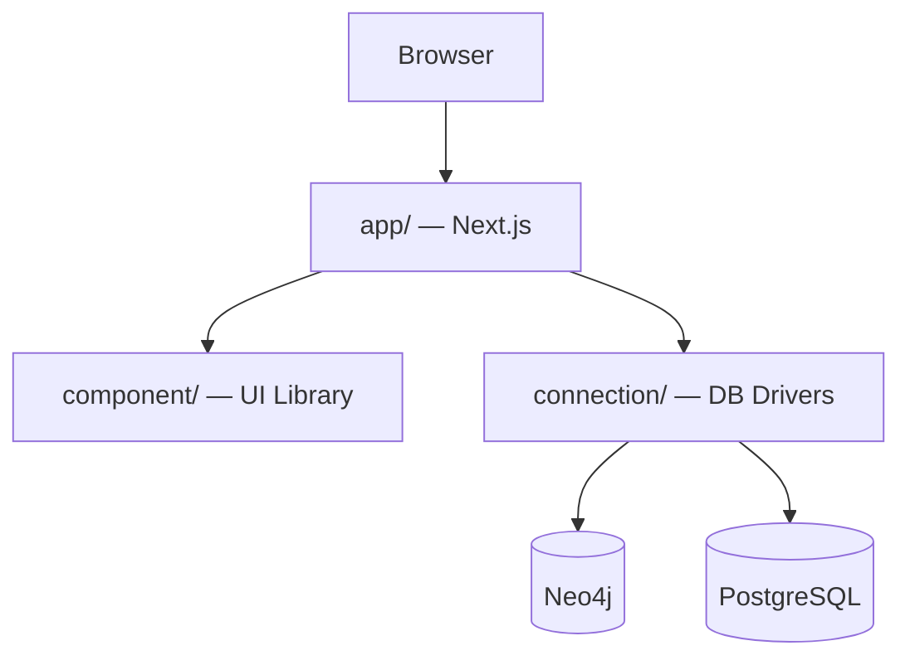

NeoBoard is a monorepo with three packages. Each package has strict boundaries that keep the codebase modular and testable.

## How the Pieces Fit Together

## The Three Packages

| Package | What it does | What it must NOT do |
|---------|-------------|---------------------|
| `app/` | API routes, pages, stores, hooks. Orchestrates the other two packages. | — |
| `component/` | React UI components, charts, forms. Viewable in Storybook. | No business logic. No API calls. No imports from `app/`. |
| `connection/` | Neo4j and PostgreSQL drivers, schema introspection, query parsing. | No UI. No React. No imports from `app/` or `component/`. |

## Why Three Packages?

- **Testability** — each package can be tested in isolation. `connection/` uses Testcontainers with real databases. `component/` uses Storybook and Vitest. `app/` runs E2E tests with Playwright.
- **Clear ownership** — UI bugs live in `component/`, driver bugs live in `connection/`, and glue logic lives in `app/`.
- **Faster builds** — changes to `component/` do not trigger a rebuild of `connection/`, and vice versa.

## Tech Stack

| Layer | Technology |
|-------|-----------|
| Framework | Next.js 15 (App Router) |
| UI | React 19, shadcn/ui, Tailwind CSS |
| Charts | ECharts (modular imports) |
| Graph | Neo4j NVL |
| Maps | Leaflet |
| State | Zustand, TanStack Query |
| Auth | Auth.js v5 |
| ORM | Drizzle |
| Testing | Vitest, Playwright, Testcontainers |

## Data Flow

A query goes through these layers:

1. **Browser** sends a request to a Next.js API route
2. **API route** validates auth, checks permissions, and calls the query executor
3. **Query executor** enforces safety (read-only transactions, timeouts, row limits)
4. **Connection module** runs the query against Neo4j or PostgreSQL
5. **Result** flows back through the API to a Zustand store, then renders in a React component

All database credentials are encrypted at rest. Queries use parameterized values — user input is never interpolated into query strings.
