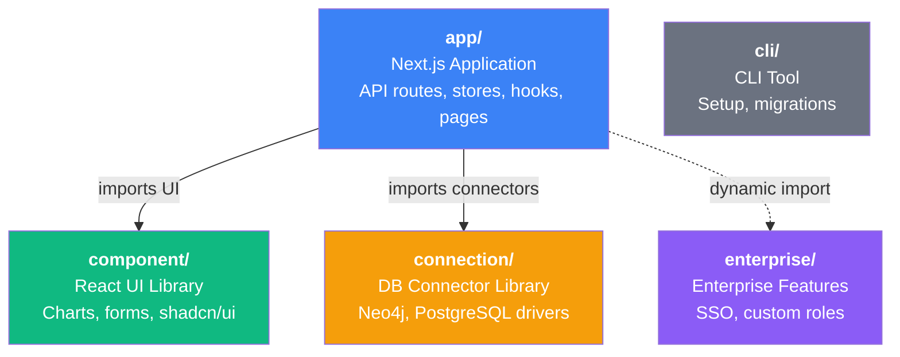

NeoBoard is a monorepo with three packages plus a CLI. Each package has strict boundaries that keep the codebase modular and testable.

## Package Boundaries

| Package | What it does | What it must NOT do |
|---------|-------------|---------------------|
| `app/` | API routes, pages, stores, hooks, plugins. Orchestrates the other two. | -- |
| `component/` | React UI components, charts, forms. Viewable in Storybook. | No business logic. No API calls. No imports from `app/`. |
| `connection/` | Neo4j and PostgreSQL drivers, schema introspection, query parsing. | No UI. No React. No imports from `app/` or `component/`. |
| `cli/` | Setup, migrations, dev server management. | Standalone Node.js tool. |

## Tech Stack

| Layer | Technology |
|-------|-----------|
| Framework | Next.js 16 (App Router) |
| UI | React 19, shadcn/ui, Tailwind CSS |
| Charts | ECharts (modular imports) |
| Graph | Neo4j NVL |
| Maps | Leaflet |
| State | Zustand (6 stores), TanStack Query |
| Auth | Auth.js v5 (JWT sessions) |
| ORM | Drizzle (PostgreSQL) |
| Testing | Vitest, Playwright, Testcontainers |
| Build | npm workspaces, Turbopack (dev), webpack (build) |

## Data Flow: Query Execution

When a widget renders its data, here is the full path:

1. **Widget component** reads parameters from the Parameter Store (Zustand)
2. **`useWidgetQuery` hook** merges parameters into the query and calls TanStack Query
3. **TanStack Query** checks its cache. On miss, sends `POST /api/query`
4. **API route** validates auth via `requireSession()`, decrypts connection credentials
5. **Query Executor** gets or creates a cached connection module
6. **Connection Module** runs the query (Cypher for Neo4j, SQL for PostgreSQL)
7. **Database** returns results
8. **Response** flows back through the API to TanStack Query cache
9. **Plugin transform** converts raw rows into chart-specific data format
10. **Chart component** renders (ECharts, NVL, Leaflet, or custom)

## State Management

NeoBoard uses **Zustand** for client-only state and **TanStack Query** for server state:

| Store | Purpose | Persistence |
|-------|---------|-------------|
| Dashboard Store | Layout, pages, widgets, grid positions | API (saved on user action) |
| Widget Editor Store | Current widget being edited (chart type, query, options) | Ephemeral (modal lifetime) |
| Parameter Store | Dashboard parameter values | localStorage per dashboard |
| Connection Store | Active connection ID, widget-to-connection mapping | Ephemeral |
| Schema Store | Cached database schemas by connection ID | Ephemeral |
| Graph Widget Store | Graph exploration state (nodes, edges, layout) | Ephemeral |

**TanStack Query** manages all API data: dashboards list, connections, users, API keys, widget templates. Mutations use optimistic updates with automatic cache invalidation.

## Plugin System

Chart types are implemented as **plugins**. Each plugin defines:

- **Component** -- the React component that renders the chart
- **Transform** -- function that converts raw query rows into chart-specific data
- **Settings Schema** -- Zod schema for type-safe chart options
- **Options** -- UI definition for the chart options panel
- **Capabilities** -- flags like `supportsClickAction`, `supportsStyling`, `isECharts`

17 chart plugins are registered at startup: bar, line, pie, gauge, single-value, table, graph, map, json, markdown, form, iframe, sankey, sunburst, radar, treemap, parameter-select.

See the [Chart Plugin Guide](/developer/extending/new-chart-plugin) to add your own.

## Authentication Flow

All routes are protected by `proxy.ts` (Next.js middleware):

1. **Public routes** pass through: `/login`, `/signup`, `/api/auth/*`, `/api/docs`, `/api/openapi*`
2. **API key requests** (`Authorization: Bearer nb_*`) pass through to server-side validation
3. **Unauthenticated page requests** redirect to `/login`
4. **Unauthenticated API requests** return `401 JSON`
5. **Authenticated requests** continue to the route handler

Inside route handlers, `requireSession()` extracts the user's `userId`, `role`, `tenantId`, and `canWrite` from the JWT or API key. Admin-only routes use `requireAdmin()`.

## Multi-Tenancy

Every data table includes a `tenant_id` column. All queries filter by the authenticated user's tenant. See [Multi-Tenancy](/administration/multi-tenancy) for details.

## Security

- **Credentials**: AES-256-GCM envelope encryption. Lost `ENCRYPTION_KEY` = unrecoverable.
- **Queries**: Always parameterized. User input never interpolated into query strings.
- **Read-only**: PostgreSQL uses `BEGIN TRANSACTION READ ONLY`. Neo4j uses `session.executeRead()`.
- **Timeouts**: Enforced at driver level (statement timeout for PostgreSQL, transaction timeout for Neo4j).
- **Rate limiting**: Login attempts limited to 20 per minute per IP.

## Where Does Code Live?

| Feature | Package | Key Directory |
|---------|---------|--------------|
| API routes | `app/` | `src/app/api/` |
| Dashboard pages | `app/` | `src/app/(dashboard)/` |
| Auth (login, signup) | `app/` | `src/app/(auth)/`, `src/lib/auth/` |
| Zustand stores | `app/` | `src/stores/` |
| React hooks | `app/` | `src/hooks/` |
| Widget editor | `app/` | `src/components/widget-editor/` |
| Chart components | `component/` | `src/charts/` |
| UI primitives (shadcn) | `component/` | `src/components/ui/` |
| Composed components | `component/` | `src/components/composed/` |
| Chart options schema | `component/` | `src/components/composed/chart-options-schema.ts` |
| Neo4j driver | `connection/` | `src/neo4j/` |
| PostgreSQL driver | `connection/` | `src/postgresql/` |
| Schema introspection | `connection/` | `src/schema/` |
| DB schema (Drizzle) | `app/` | `src/lib/db/schema.ts` |
| Migrations | `app/` | `drizzle/migrations/` |
| E2E tests | `app/` | `e2e/` |
| SSO (enterprise) | `enterprise/` | `src/` |

## Common Tasks

### Add a new API route

1. Create `app/src/app/api/your-route/route.ts`
2. Use `requireSession()` or `requireAdmin()` for auth
3. Use `apiSuccess()` / `apiError()` for response envelope
4. Add tests in `__tests__/route.test.ts` next to the route
5. See any existing route in `app/src/app/api/` for the pattern

### Add a new chart type

Follow the [Chart Plugin Guide](/developer/extending/new-chart-plugin). Key steps:
1. Create the chart component in `component/src/charts/`
2. Register it in `app/src/lib/chart-registry.ts`
3. Add chart options in `component/src/components/composed/chart-options-schema.ts`

### Add a new setting

1. Add the env var to `.env.example`
2. Read it in the relevant module via `process.env.YOUR_VAR`
3. Document it in `docs/src/content/docs/getting-started/configuration.mdx`

### Add a new database table

1. Add the Drizzle schema in `app/src/lib/db/schema.ts`
2. Run `npm run db:generate` to create the migration
3. Add inferred types at the bottom of `schema.ts`
